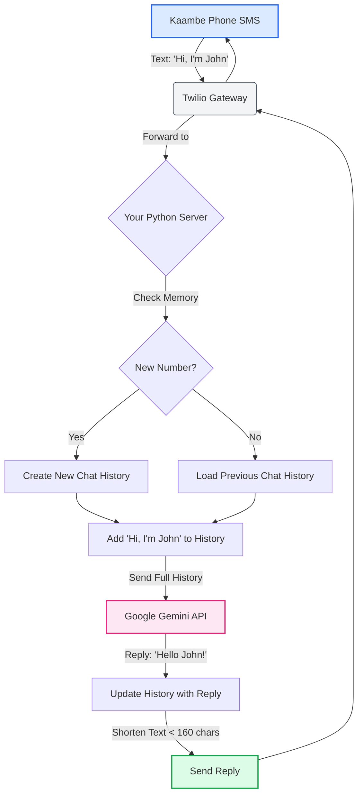

# Kaduda AI Brainstorm 🧠📱

> **Bridging the gap between feature phones and advanced AI.**

**Kaduda AI** is an innovative concept designed to bring the power of Large Language Models (LLMs) like Google Gemini to basic feature phones ("Kaambe" phones) via SMS. This project visualizes the architectural workflow required to build a context-aware, SMS-based conversational agent.

---

## 🌟 Project Overview

Millions of users in emerging markets rely on feature phones with limited internet connectivity. Kaduda AI solves this by using **SMS as the transport layer** for AI interactions. Users can chat with an AI assistant just as they would with a friend, without needing 4G/5G or a smartphone.

### Key Features
*   **SMS Interface**: Works on any phone capable of texting.
*   **Context Awareness**: Remembers conversation history for natural dialogue.
*   **Smart Conciseness**: Automatically condenses AI responses to fit within the 160-character SMS limit.
*   **Visual Logic**: Includes an interactive simulation of the backend process.

---

## 🏗️ Architecture Workflow

The system operates on a seamless loop between the user, the telecom gateway, and the AI backend.

### The Flow
1.  **User Input**: User sends a text (e.g., "Hi, I'm John") from their feature phone.
2.  **Gateway (Twilio)**: Intercepts the SMS and forwards the payload to the backend via Webhook.
3.  **Python Server**: The core logic handler.
    *   **Memory Check**: Identifies the user by phone number.
    *   **Context Loading**: Retrieves past chat history (or creates a new session).
4.  **AI Processing (Gemini)**: The full conversation history is sent to the Google Gemini API.
5.  **Response Handling**:
    *   Gemini generates a reply.
    *   **Shortener Logic**: The server truncates or summarizes the reply to <160 characters to save SMS costs and ensure delivery.
6.  **Delivery**: The message is routed back through Twilio to the user's phone.

### Visual Workflow



---

## 🚀 Visualization & Simulation

This repository contains a **High-Fidelity Interactive Preview** of the workflow.

### How to Use
1.  Open `kaduda_workflow_preview.html` in any modern web browser.
2.  **View the Diagram**: A clear, Mermaid.js-powered flowchart on the left.
3.  **Run Simulation**: Click the **▶ Run Simulation** button.
    *   Watch the process flow step-by-step.
    *   The diagram nodes will **light up** in emerald green as the data flows through them.
    *   The "Live Logic Flow" sidebar will explain exactly what is happening at each step.

---

## 🛠️ Technology Stack (Concept)

*   **Frontend logic**: HTML5, CSS3 (Glassmorphism/Cyber-Dark Theme), Vanilla JavaScript.
*   **Diagramming**: Mermaid.js (for dynamic graph rendering).
*   **Backend (Proposed)**: Python (Flask/FastAPI).
*   **Telecom**: Twilio SMS API.
*   **AI Model**: Google Gemini Pro.

---

## 📂 File Structure

```text
.
├── kaduda_workflow.md          # Source diagrams in Mermaid syntax
├── kaduda_workflow_preview.html # Interactive HTML visualization
└── README.md                   # Project documentation
```

---

## 🔮 Future Roadmap

*   [ ] Build the actual Python Flask backend.
*   [ ] Integrate Twilio Sandbox for live testing.
*   [ ] accurate token counting for context window management.
*   [ ] Multi-language support (Swahili/English) for broader reach.

---

**Author**: Akubrecah
**Status**: Architecture & Brainstorming Phase
